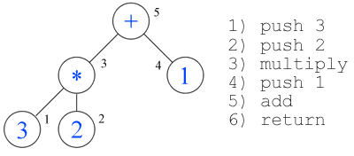

# MSIL parser

See the [blog post](https://www.codeproject.com/Articles/32308/Using-Reflection-Emit-to-Precompile-Expressions-to)

The classes in this project allow you to parse text expressions entered by a user and compile them to a .NET assembly. This assembly can be executed on the fly, or saved to a DLL. Pre-compiling expressions allows for a high level of portability, and enables us to evaluate user entered logic extremely efficiently. In addition, we can use Microsoft’s `ildasm.exe` tool to open and inspect the underlying MSIL code being generated.

MSIL is Microsoft’s intermediate language for the .NET framework. IL is what your C# and VB.NET code gets compiled into and is sent to the JIT compiler when .NET programs are run. MSIL is a very low level language that is very fast, and working with it gives you exceptional control over your programs.

## Background

Let’s have a quick overview of what our parser/compiler will be doing. The user will enter a string expression that matches our parser’s grammar. This expression will be turned into a tiny .NET program that will run and output the result.

To do this, the parser will read in the sequential list of characters, and break it down into a hierarchal parse tree as seen below. The nodes are evaluated in the order shown. When a node is matched, the appropriate instruction is called for that node type. For instance, when a number is matched, we push that number onto the stack. When the “\*” token is matched, we call the multiply instruction, and so on. Adding up all the instructions in their proper order gives us the “program” seen to the right.



## Usage

This project contains two classes for parsing the expression and compiling it into MSIL. The first class is `RuleParser`, which is an abstract parsing class that contains all the lexing and parsing logic for our particular grammar.

This class parses the statement but doesn’t take any actions. The code excerpt below shows that when the `ttAdd` token is found, the parser calls the `matchAdd()` method which is an abstract method defined on the `RuleParser` class. It is up to the concrete class to implement the method body and the corresponding semantic action.


This pattern allows us to implement a separate concrete class to handle semantic actions, and means that we can implement different concrete classes depending on what we are trying to accomplish. This code was previously setup to evaluate expressions on the fly by calculating nodes as soon as they were found. We can now swap in our `MsilParser` to compile the expression to an IL program using the same parsing class.

The `MsilParser` does this by implementing all of the necessary token functions and emitting the appropriate IL instructions. For example, the `matchAdd()` function simply inserts an `Add` command. When a variable is matched, we load the variable name with the `Ldstr` instruction, then call the `GetVar` method.

```csharp
protected override void matchAdd()
{
    this.il.Emit(OpCodes.Add);
}
protected override void matchVar()
{
    string s = tokenValue.ToString();
    il.Emit(OpCodes.Ldstr, s);
    il.Emit(OpCodes.Call, typeof(MsilParser).GetMethod(
            "GetVar", new Type[] { typeof(string) }));
}
```

Once all of the tokens have been setup, we can call the `CompileMsil()` method of our `MsilParser` class which runs the parser and returns the compiled .NET type using the `AssemblyBuilder` classes in the `Relection.Emit` namespace.

Using `Reflection.Emit` to Precompile Expressions to MSIL

```csharp
/// <summary>
/// Builds and returns a dynamic assembly
/// </summary>
public Type CompileMsil(string expr)
{
    // configure names to use
    string assemblyName = "Expression";
    string modName = "expression.dll";
    string typeName = "Expression";
    string methodName = "RunExpression";

    // get name of assembly
    AssemblyName name = new AssemblyName(assemblyName);

    // get current system thread domain
    AppDomain domain = System.Threading.Thread.GetDomain();

    // create builders to be used
    AssemblyBuilder builder = domain.DefineDynamicAssembly(
      name, AssemblyBuilderAccess.RunAndSave);

    ModuleBuilder module = builder.DefineDynamicModule
      (modName, true);

    TypeBuilder typeBuilder = module.DefineType(typeName,
      TypeAttributes.Public | TypeAttributes.Class);

    MethodBuilder methodBuilder = typeBuilder.DefineMethod(methodName,
      MethodAttributes.HideBySig | MethodAttributes.Static
      | MethodAttributes.Public,
      typeof(Object), new Type[] {  });

    // Build the dynamic assembly
    // Create the ILGenerator to insert code into our method body
    ILGenerator ilGenerator = methodBuilder.GetILGenerator();
    this.il = ilGenerator;

    // Parse the expression. This will insert MSIL instructions
    this.Run(expr);

    // Finish the method by boxing the result as Double
    this.il.Emit(OpCodes.Conv_R8);
    this.il.Emit(OpCodes.Box, typeof(Double));
    this.il.Emit(OpCodes.Ret);

    // Create and save the Assembly and return the type
    Type myClass = typeBuilder.CreateType();

    // save the DLL file: expression.dll to disk
    builder.Save(modName);
    return myClass;
}
```

The end result is a .NET assembly that can be executed, cached, or saved to disk. Here is a look at the IL code for our method that was created by our compiler:

```txt
.method public hidebysig static object
        RunExpression() cil managed
 {
   // Code size       36 (0x24)
   .maxstack  2
   IL_0000:  ldc.r8     3.
   IL_0009:  ldc.r8     2.
   IL_0012:  mul
   IL_0013:  ldc.r8     1.
   IL_001c:  add
   IL_001d:  conv.r8
   IL_001e:  box        [mscorlib]System.Double
   IL_0023:  ret
 } // end of method Expression::RunExpression
```

The main benefit of this approach is that parsing the expression takes much longer than just executing the instructions.

By pre-compiling the expression to IL, we only need to parse the expression once instead of every time it’s evaluated. Although this example only uses one expression, a real implementation could involve thousands of expressions precompiled and executed on demand. In addition, we also have our code packaged up in a nice .NET DLL that we can do whatever we want with.

This example can be evaluated over 1 million times in less than 3 one hundredths of a second!

## Using the Sample Project

The sample project allows you to enter an expression in the top left textbox. When you click Parse, the form will parse the expression and create a .NET assembly with your compiled code in the `RunExpression()` function. The program will then call that function the specified number of times, and show how long it took to execute. Finally, the program will save the assembly as `expression.dll` and run Microsoft’s `ildasm.exe` to output the full MSIL code for the assembly so you can see the code that was generated for your program.


## Points of interest

How our dynamic method gets called will considerably affect performance. For example, simply using the `Invoke()` method on a Dynamic Method will dramatically slow down the performance when called 1 million times. Using a generic delegate signature, like in the code below, gives us about 20X better performance.

```csharp
// Parse the expression and build our dynamic method
MsilParser em = new MsilParser();
Type t = em.CompileMsil(textBox1.Text);

// Get a typed delegate reference to our method. This is very
// important for efficient calls!
MethodInfo m = t.GetMethod("RunExpression");
Delegate d = Delegate.CreateDelegate(
  typeof(MsilParser.ExpressionInvoker<Object>), m);
MsilParser.ExpressionInvoker<Object> method =
(MsilParser.ExpressionInvoker<Object>)d;
// Call the function
Object result = method();
```

## Calling ILDASM.EXE

The sample project will also let you view the entire MSIL code for your newly created assembly. It does this by calling ildasm.exe in the background and outputting the result to a textbox. The ildasm.exe is a very useful tool for anyone working with IL code or the `System.Reflection.Emit` namespace. The code below shows how to use this executable in your program using the `System.Diagnostics` namespace.

Checkout Microsoft’s documentation on `ildasm.exe` in the links below.

```txt
// Save the Assembly and generate the MSIL code with ILDASM.EXE
string modName = "expression.dll";
Process p = new Process();
p.StartInfo.FileName = "ildasm.exe";
p.StartInfo.Arguments = "/text /nobar \"" + modName;
p.StartInfo.UseShellExecute = false;
p.StartInfo.CreateNoWindow = true;
p.StartInfo.RedirectStandardOutput = true;
p.StartInfo.WindowStyle = ProcessWindowStyle.Hidden;
p.Start();
string s = p.StandardOutput.ReadToEnd();
p.WaitForExit();
p.Close();
txtMsil.Text = s;
```

## Resources

- [Using Reflection.Emit](<https://docs.microsoft.com/en-us/previous-versions/dotnet/netframework-4.0/3y322t50(v=vs.100)>)
- [System.Reflection.Emit Namespace](https://docs.microsoft.com/en-us/dotnet/api/system.reflection.emit?redirectedfrom=MSDN&view=netframework-4.7.2)
- [MSIL Disassembler (Ildasm.exe)](<https://docs.microsoft.com/en-us/previous-versions/dotnet/netframework-2.0/f7dy01k1(v=vs.80)>)
- [MSIL Tutorial](https://www.codeguru.com/csharp/.net/net_general/il/article.php/c4635/MSIL-Tutorial.htm)
- [Get Drunk on the Power of Reflection.Emit](http://www.devx.com/dotnet/Article/28783) With `Reflection.Emit`, you can add dynamic typing to your C# applications and enter a strange new world.
